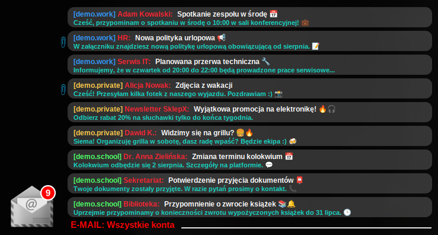
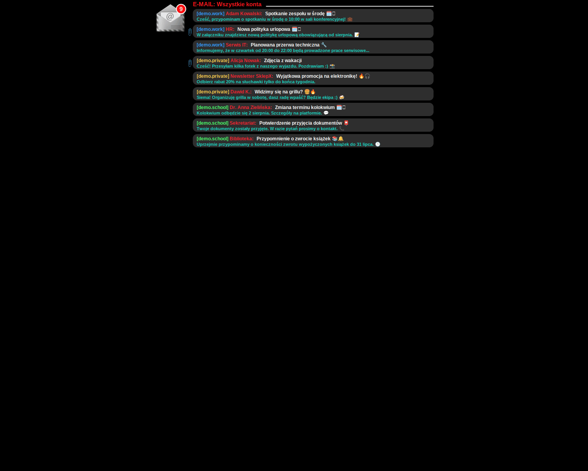
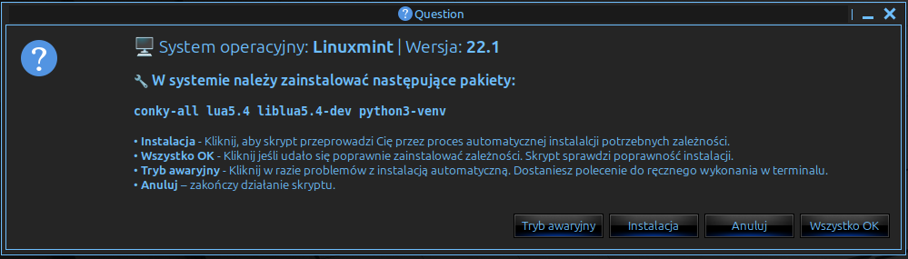
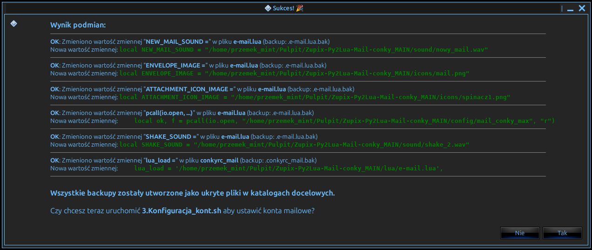
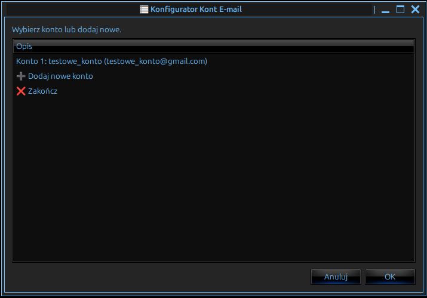
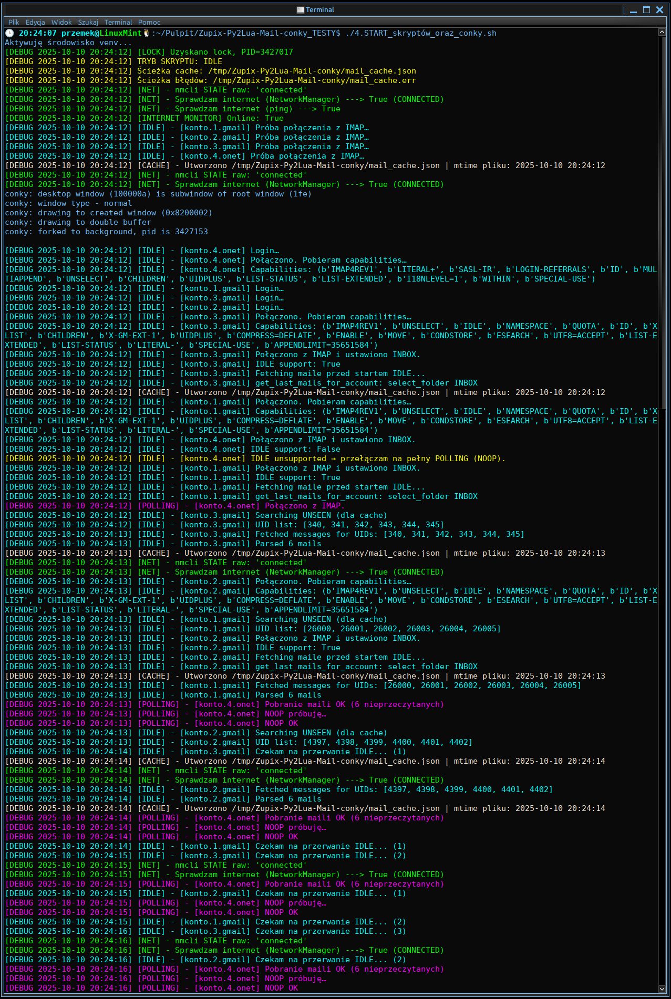
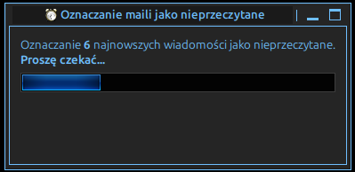
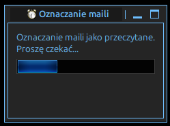
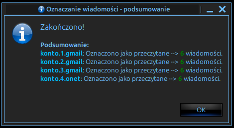
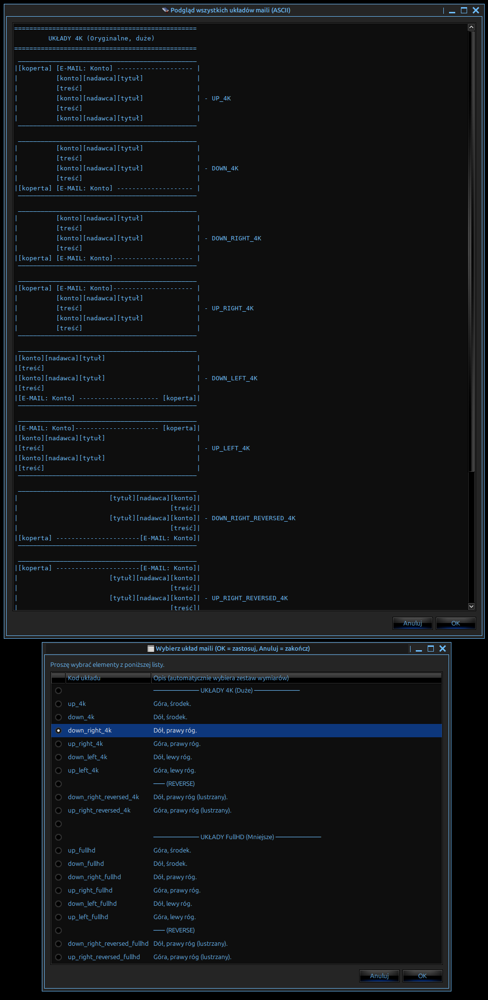

# Zupix-Py2Lua-Mail-Conky




**Zupix-Py2Lua-Mail-Conky** to zaawansowany, interaktywny i w pełni konfigurowalny widget e-mail dla Conky, zasilany przez wydajny backend w Pythonie.

Projekt powstał z myślą o wygodnym monitorowaniu wielu skrzynek pocztowych bezpośrednio z pulpitu – bez potrzeby ciągłego otwierania klienta poczty. Widget składa się z inteligentnego backendu, który łączy się z serwerami IMAP, oraz wysoce konfigurowalnego frontendu w Lua, renderowanego przez Conky. Całość jest zarządzana przez zestaw przyjaznych dla użytkownika skryptów instalacyjnych i konfiguracyjnych z interfejsem graficznym.

---

### Spis Treści
*   [Główne Funkcje](#główne-funkcje)
    *   [Backend (Python) — Silnik projektu](#1-backend-python--silnik-projektu-zupix-py2lua-mail-conky)
    *   [Frontend (LUA) - Konfigurowalny interfejs graficzny](#2-frontend-lua---konfigurowalny-interfejs-graficzny)
    *   [Przyjazny dla użytkownika zbiór narzędzi](#przyjazny-dla-użytkownika-zbiór-narzędzi)
*   [Architektura Projektu](#architektura-projektu)
    *   [Backend (Python)](#1-backend-python)
    *   [Frontend (Lua / Conky)](#2-frontend-lua--conky)
    *   [Skrypty Pomocnicze (Bash / Zenity)](#3-skrypty-pomocnicze-bash--zenity)
*   [Struktura Projektu](#struktura-projektu)
*   [Instalacja i Konfiguracja](#instalacja-i-konfiguracja)
*   [Interakcja z Widgetem](#interakcja-z-widgetem)
*   [Zależności](#zależności)
*   [Licencja](#licencja)

---

## Główne Funkcje

Ten projekt to znacznie więcej niż prosty skrypt do sprawdzania poczty. Został rozbudowany o szereg zaawansowanych funkcji, które czynią go kompletnym narzędziem na pulpit:

### 1. Backend (Python) — Silnik projektu "Zupix-Py2Lua-Mail-Conky"

To serce i mózg całej operacji, zaprojektowane do stabilnej i wydajnej pracy 24/7 w tle. To znacznie więcej niż prosty skrypt – to cichy i inteligentny demon, którego główne cechy to:

*   **Podwójny tryb pracy do wyboru:**
    *   **IMAP IDLE:** Zalecany tryb nasłuchu, który pozwala na otrzymywanie powiadomień bez ciągłego odpytywania serwera. Reakcja następuje zazwyczaj w ciągu kilku do kilkunastu sekund (co jest cechą charakterystyczną serwerów IMAP + IDLE), a wszystko to przy minimalnym zużyciu zasobów systemowych.
    *   **Polling:** Tradycyjny tryb cyklicznego odpytywania serwera oraz pobierania maili w regularnych, definiowanych przez użytkownika odstępach czasu. Sprawdzi się wszędzie tam, gdzie tryb IDLE nie jest obsługiwany, oraz tam gdzie nie lubimy kompromisów 😎.

*   **Automatyczny Fallback do trybu polling (Per-konto):** To jedna z ważniejszych funkcji backendu. Nawet jeśli globalnie wybrany jest tryb IDLE, przy nawiązywaniu połączenia skrypt sprawdza, czy serwer danego konta faktycznie wspiera komendę `IDLE`. Jeśli nie, **tylko to jedno konto jest automatycznie i płynnie przełączane w tryb Polling**, podczas gdy pozostałe konta nadal korzystają z IDLE. Pozwala to na bezproblemową pracę w środowisku mieszanym.

*   **Inteligentny monitor sieci:** Backend nie próbuje łączyć się w nieskończoność, gdy nie ma internetu. Posiada dwuetapowy system monitorowania połączenia:
    -  **Sprawdzenie systemowe (`nmcli`):** Błyskawicznie odczytuje status z NetworkManagera.
    -  **Aktywny test połączenia:** Jeśli status jest niejasny, wykonuje test połączenia (przez `ping` lub próbę otwarcia socketu), aby mieć 100% pewności.
    Dzięki temu w trybie offline skrypt wstrzymuje pracę, nie generuje zbędnych błędów i automatycznie wznawia ją, gdy tylko połączenie wróci.

*   **Rozbudowane oczyszczanie treści (Denoising):** Zanim treść maila trafi do widgetu, przechodzi przez zaawansowany proces filtrowania, który usuwa cyfrowy "szum" i wyciąga samą esencję wiadomości. Mechanizm ten usuwa m.in.:
    *   Niepotrzebne tagi HTML (`<style>`, `<script>`, nagłówki).
    *   Automatyczne stopki i noty prawne ("Ta wiadomość jest poufna...").
    *   Fragmenty cytowanych odpowiedzi ("W dniu ... użytkownik ... napisał:").
    *   Standardowe sygnatury mailowe.

*   **Wielowątkowa architektura:** Każde skonfigurowane konto e-mail działa w swoim własnym, odizolowanym wątku. Gwarantuje to, że ewentualny problem z jednym kontem (np. powolny serwer, błąd logowania) **nigdy nie zablokuje ani nie spowolni działania pozostałych kont**.

*   **Odporność na błędy i płynne wznawianie pracy:** Backend jest przygotowany na przejściowe problemy z siecią. Rozpoznaje typowe, chwilowe błędy połączenia i zamiast kończyć pracę z błędem, cierpliwie próbuje połączyć się ponownie. Posiada również mechanizm **graceful shutdown** – po otrzymaniu sygnału zamknięcia (np. od systemu) bezpiecznie zapisuje ostatnie zmiany oraz zamyka wszystkie połączenia i wątki.

*   **Blokada pojedynczej instancji:** Skrypt zapewnia, że w danym momencie działa tylko jedna jego kopia, co zapobiega zbędnemu zużyciu zasobów i potencjalnym konfliktom w dostępie do plików tymczasowych.

### 2. Frontend (LUA) - konfigurowalny interfejs graficzny
*   **Pełna konfiguracja wizualna:** Dostosuj wygląd widgetu w najmnijeszym szczególe edytując plik e-mail.lua w sekcji `--  BLOK DEFINICJI WYMIARÓW` albo skorzystaj z 16 gotowych układów dopasowanym do każdego rogu pulpitu dla rozdzielczości 4K oraz FullHD, za pomocą skryptu `Zmiana_pozycji_okna_conky_oraz_layoutu.sh`. Dodatkowo za pomocą skryptu `Zmiana_skalowania.sh` dostępna jest opcja globalnego skalowania, gdyby zaszła potrzeba delikatnej korekty wielkości widgetu.



*   **Zarządzanie blokiem mailowym w czasie rzeczywistym:**
    -   **Przewijanie listy maili:** Widget reaguje na zmiany w pliku sterującym `/tmp/Zupix-Py2Lua-Mail-conky/conky_mail_scroll_offset`, umożliwiając przewijanie listy za pomocą skrótów klawiszowych.
      
      Aby sprawnie i szybko manipulować indeksem należy dodać skrypty `add_hotkey_mail_down.sh` oraz `add_hotkey_mail_up.sh` jako polecenia do skrótów klawiszowych.
    Listę można dowolnie przesuwać góra/dół, a po dojechaniu do końca listy uruchomi się animacja "shake". Po kilku sekundach skrypt automatycznie wraca indeks do pozycji 0.
    
    -   **Filtrowanie kont:** Dynamicznie przełączanie widoku między wszystkimi kontami, za pomocą skryptu `Zmień_konto.sh`
    -   **Zaawansowane renderowanie tekstu:** Duże wsparcie dla **emoji** w tematach i podglądzie wiadomości, a także animowane, płynne przewijanie (`marquee`) dla zbyt długich treści.

#### Przyjazny dla użytkownika zbiór narzędzi:

*   **Sprytny zestaw skryptów instalacji oraz konfiguracji w GUI z wykorzyztaniem Zenity:** Zapomnij o ręcznej edycji plików oraz potrzebnych zależnościach! Projekt zawiera zestaw skryptów z interfejsem graficznym (`Zenity`), które prowadzą użytkownika krok po kroku przez cały proces:
      - Automatycznego wykrywania dystrybucji i instalacji odpowiednich zależności. **`1.Instalacja_zależności.sh`**
   
      - Automatycznej konfiguracji wszystkich niezbędnych ścieżek w plikach projektu. **`2.Podmiana_ścieżek_bezwzględnych_w_zmiennych.sh`** (Przenieś folder gdzie chcesz i nazwij jak chcesz 😉)
   
      - Graficzny menedżer do dodawania, edytowania, przesuwania oraz usuwania kont e-mail. **`3.Konfiguracja_kont.sh`**
   
   
      - **Solidne zarządzanie procesami:** Główny skrypt startowy **`4.START_skryptów_oraz_conky.sh`** dba o to, by widget działał nieprzerwanie i stabilnie. Zawiera mechanizm "watchdoga", który automatycznie restartuje Conky w razie awarii lub nadmiernego zużycia pamięci. Uruchomiony ręcznie w oknie terminala dostarcza dużo informacji na temat tego co dzieje się pod maską.

*   **Narzędzia pomocnicze:** Zestaw skryptów do łatwego testowania i zarządzania widgetem (np. oznaczanie maili jako przeczytane/nieprzeczytane, zmiana layoutu w locie).

     
    - Wsadowe oznaczanie wiadomości na kontach jako nieprzeczytane. **`Oznacz_n_wiadomości_jako_nieprzeczytane.sh`**       



    - Wsadowe oznaczanie wiadomości na kontach jako przeczytane. **`Oznacz_wszystkie_wiadomości_jako_przeczytane.sh`**     
      


    - Skrypt do płynnej zmiany layoutów podczas działania widgetu. **`Zmiana_pozycji_okna_conky_oraz_layoutu.sh`**
   

---

## Architektura Projektu

Projekt oparty jest na trzech głównych, współpracujących ze sobą komponentach:

### 1. Backend (Python)

To serce operacji, działające w tle jako cichy i wydajny demon. Jego główne zadania to:

*   **Nawiązywanie połączeń IMAP:** Utrzymuje stałe połączenie z serwerami pocztowymi w trybie IDLE lub cyklicznym Polling.
*   **Pobieranie i przetwarzanie danych:** Odczytuje nowe wiadomości, czyści ich treść z niepotrzebnych elementów i przygotowuje do wyświetlenia.
*   **Generowanie cache:** Przetworzone dane o mailach są zapisywane w pliku tymczasowym (`JSON`), który służy jako źródło danych dla frontendu.

### 2. Frontend (Lua / Conky)

To warstwa wizualna, którą widzisz na pulpicie. Skrypt Lua renderowany przez Conky jest odpowiedzialny za:

*   **Odczyt danych:** W każdej pętli pobiera najnowsze informacje o mailach z pliku cache.
*   **Renderowanie grafiki:** Używając biblioteki Cairo, rysuje cały interfejs widgetu, w tym tekst, ikony, tła i animacje.
*   **Obsługa interakcji:** Odczytuje pliki sterujące, aby reagować na akcje użytkownika, takie jak przewijanie listy czy zmiana aktywnego konta.

### 3. Skrypty Pomocnicze (Bash / Zenity)

To przyjazny dla użytkownika "klej", który spaja cały system. Zestaw skryptów z interfejsem graficznym (`Zenity`) automatyzuje podstawowe aspekty zarządzania projektem:

*   **Instalacja i konfiguracja:** `1.Instalacja_zależności.sh` --> `2.Podmiana_ścieżek_bezwzględnych_w_zmiennych.sh` --> `3.Konfiguracja_kont.sh` -  Prowadzą użytkownika krok po kroku przez cały proces, od instalacji zależności po dodanie kont e-mail.
*   **Zarządzanie i sterowanie:** `4.START_skryptów_oraz_conky.sh`, `Zmiana_pozycji_okna_conky_oraz_layoutu.sh`, `Zmień_konto.sh` -  Pozwalają zarządzać cyklem życia całej aplikacji, w locie zmieniać układ widgetu, a także przełączać widok kont.

---

## Struktura Projektu

Projekt jest zorganizowany w sposób modułowy, co ułatwia jego zrozumienie i ewentualną rozbudowę:
```
.
├── 1.Instalacja_zależności_v2_beta.sh              # Krok 1: Instalator zależności
├── 2.Podmiana_ścieżek_bezwzględnych_w_zmiennych.sh # Krok 2: Konfigurator ścieżek
├── 3.Konfiguracja_kont.sh                          # Krok 3: Menedżer kont e-mail
├── 4.START_skryptów_oraz_conky.sh                  # Główny skrypt uruchomieniowy z watchdogiem
├── config                                          # Pliki konfiguracyjne
│   ├── accounts.json                               # Dane kont (dla backendu)
│   └── mail_conky_max                              # Opcjonalny limit maili na liście
├── conkyrc_mail                                    # Główny plik konfiguracyjny Conky
├── icons                                           # Ikony używane przez widget
├── lua                                             # Skrypty frontendu (Lua)
│   └── e-mail.lua                                  # Główna logika wizualna widgetu
├── py                                              # Skrypty backendu (Python)
│   └── python_mail_conky_lua.py                    # Główny skrypt pobierający maile
└── sound                                           # Pliki dźwiękowe dla powiadomień
```
---

## Instalacja i Konfiguracja

Instalacja jest niezwykle prosta dzięki graficznemu kreatorowi. **Ręczna edycja plików konfiguracyjnych nie jest potrzebna.**


1.  **Sklonuj repozytorium**:
    Otwórz terminal i wklej poniższe komendy. Pierwsza pobierze projekt, a druga wejdzie do jego głównego katalogu z plikami:
    ```bash
    git clone https://github.com/ZupixUI/Zupix-Py2Lua-Mail-conky.git
    cd Zupix-Py2Lua-Mail-conky/Zupix-Py2Lua-Mail-conky
    ```
    Możesz też pobrać gotową paczkę  - https://github.com/ZupixUI/Zupix-Py2Lua-Mail-conky/releases

2.  **Nadaj uprawnienia do wykonania skryptom**:
    Skrypty sh powinny być oznaczone jako wykonywalne, ale gdyby z jakiś powodów tak nie było, to wykonaj tą prostą komednę która zmieni uprawienia we wszystkich skryptach sh:
    ```bash
    chmod +x *.sh
    ```

3.  **Uruchom instalator**:
    To jedyny krok, który musisz wykonać. Uruchom pierwszy skrypt `1.Instalacja_zależności.sh`, a reszta zrobi się sama! Poprowadzi Cię on przez cały proces: instalację zależności, konfigurację ścieżek oraz dodawanie kont e-mail za pomocą graficznego menedżera. Po zakończeniu konfiguracji, instalator zaproponuje automatyczne uruchomienie widgetu.
    Skrypty zostały zaprojektowane do uruchamiania bezpośrednio z poziomu środoiwska graficznego, ale jeśli napotkasz jakiś problem z uruchomieniem użyj po prostu:
    ```bash
    ./1.Instalacja_zależności.sh
    ```
    Postepuj tak samo z resztą skryptów, jeśli z jakiś powodów skrypt pierwszy po zakończonej pracy nie uruchomi kolejnego skryptu.
    
    ## Interakcja z Widgetem

    Zmiana układu i pozycji: Uruchom skrypt Zmiana_pozycji_okna_conky_oraz_layoutu.sh.

    Filtrowanie kont: Uruchom Zmień_konto.sh.

    Przewijanie listy maili: Skrypty add_hotkey_mail_up.sh i add_hotkey_mail_down.sh są przeznaczone do przypisania pod globalne skróty klawiszowe w Twoim środowisku graficznym.

## Zależności

Instalator automatycznie zajmie się instalacją wszystkich wymaganych pakietów. Główne zależności to:

  *  `conky-all` dla Debian/Ubuntu lub `conky` (z obsługą Lua/Cairo)

  *  `python3` + python3-venv (dla dystrybucji Debian i pochodnych)

  *  `lua` (zalecana wersja 5.3/5.4)

  *  `zenity` (dla interfejsu graficznego skrypotów *.sh)

  *  `jq` (do edycji plików JSON)

  *  `libnotify` (dla powiadomień systemowych notify-send)

  *  `Noto Color Emoji` Czcionka z emotkami.

## Licencja

Projekt jest udostępniony na licencji GPL v3+.
