# Zupix-Py2Lua-Mail-Conky
> Cache mailowy wygenerowany przez AI na potrzby demonstracyjne

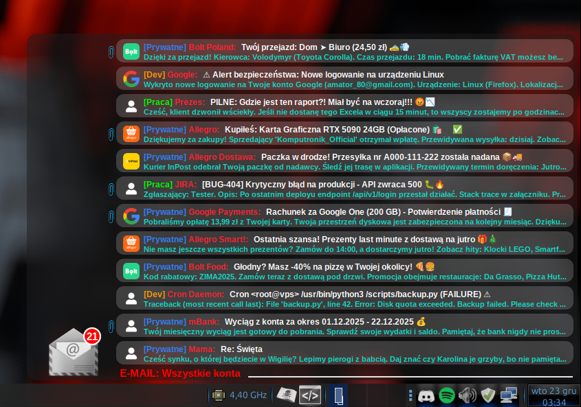
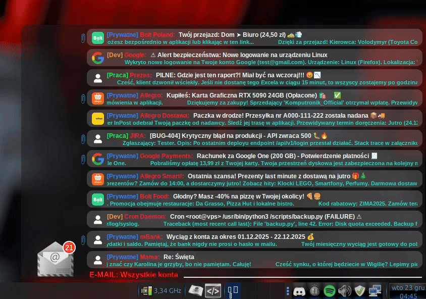


**Zupix-Py2Lua-Mail-Conky** to zaawansowany, interaktywny i w pełni konfigurowalny widget e-mail dla Conky, zasilany przez wydajny backend w Pythonie.

Projekt powstał z myślą o wygodnym monitorowaniu wielu skrzynek pocztowych bezpośrednio z pulpitu – bez potrzeby ciągłego otwierania klienta poczty. Widget składa się z inteligentnego backendu, który łączy się z serwerami IMAP, oraz wysoce konfigurowalnego frontendu w Lua, renderowanego przez Conky. Całość jest zarządzana przez zestaw przyjaznych dla użytkownika skryptów instalacyjnych i konfiguracyjnych z interfejsem graficznym.

---

**Kilka słów ode mnie na temat projektu**

Ten projekt to efekt mojego hobbystycznego zapału i... szczerej ciekawości. Chciałem sprawdzić, czy uda mi się stworzyć coś ciekawego przy pomocy sztucznej inteligencji.

Od razu powiem, że bez wsparcia AI ten projekt nie powstałby w takiej formie jak obecnie, a prawdopodobnie nie powstałby wcale. AI była (i nadal jest) świetnym narzędziem do generowania kodu i rozwiązywania konkretnych problemów. Warto jednak pamiętać, że nie zrobi wszystkiego za nas. Za każdą działającą funkcją kryją się niezliczone godziny mojej własnej pracy: testowania, szukania błędów, poprawiania i zastanawiania się, czy można coś zrobić lepiej i optymalniej.

Nie jestem zawodowym programistą (nawet nie zajmuję się programowaniem hobbystycznie), więc bardziej doświadczeni deweloperzy pewnie zrobiliby większość rzeczy zdecydowanie lepiej, wydajniej i nazwaliby ten projekt typowym "szpontem". I to jest w porządku. Celem było stworzenie czegoś, co przede wszystkim działa, jest stabilne, spełnia moje oczekiwania i przy okazji całkiem nieźle wygląda na pulpicie, a nie czegoś, co ma się trzymać rygorystycznych wytycznych poprawnego kodowania.

AI jest fantastycznym pomocnikiem, ale nie ukrywam, że w tym przypadku znajomość Linuksa na pewno bardzo pomogła i pozwoliła mi łatwiej połączyć te wszystkie skrypty w jedną, spójną całość. Mam nadzieję, że ten projekt pokaże innym pasjonatom Linuksa, że nie trzeba być ekspertem w programowaniu, by z pomocą nowoczesnych narzędzi AI i własnej determinacji stworzyć coś fajnego i użytecznego.

---

### Spis Treści
*   [Główne Funkcje](#główne-funkcje)
    *   [Backend (Python) — Silnik projektu](#1-backend-python--silnik-projektu-zupix-py2lua-mail-conky)
    *   [Frontend (LUA) - Konfigurowalny interfejs graficzny](#2-frontend-lua---konfigurowalny-interfejs-graficzny)
    *   [Przyjazny dla użytkownika zbiór narzędzi](#przyjazny-dla-użytkownika-zbiór-narzędzi)
*   [Architektura Projektu](#architektura-projektu)
    *   [Backend (Python)](#1-backend-python)
    *   [Frontend (Lua / Conky)](#2-frontend-lua--conky)
    *   [Skrypty Pomocnicze (Bash / Zenity)](#3-skrypty-pomocnicze-bash--zenity)
*   [Struktura Projektu](#struktura-projektu)
*   [Instalacja i Konfiguracja](#instalacja-i-konfiguracja)
*   [Zależności](#zależności)
*   [Licencja](#licencja)

---

## Główne Funkcje

Ten projekt to znacznie więcej niż prosty skrypt do sprawdzania poczty. Został rozbudowany o szereg zaawansowanych funkcji, które czynią go kompletnym narzędziem na pulpit:

### 1. Backend (Python) — Silnik projektu "Zupix-Py2Lua-Mail-Conky"

To serce i mózg całej operacji, zaprojektowane do stabilnej i wydajnej pracy 24/7 w tle. To znacznie więcej niż prosty skrypt – to cichy i inteligentny demon, którego główne cechy to:

*   **Podwójny tryb pracy do wyboru:**
    *   **IMAP IDLE:** Zalecany tryb nasłuchu, który pozwala na otrzymywanie powiadomień bez ciągłego odpytywania serwera. Reakcja następuje zazwyczaj w ciągu kilku do kilkunastu sekund (co jest cechą charakterystyczną serwerów IMAP + IDLE), a wszystko to przy minimalnym zużyciu zasobów systemowych.
    *   **Polling:** Tradycyjny tryb cyklicznego odpytywania serwera oraz pobierania maili w regularnych, definiowanych przez użytkownika odstępach czasu. Sprawdzi się wszędzie tam, gdzie tryb IDLE nie jest obsługiwany, oraz tam gdzie nie lubimy kompromisów 😎.

*   **Automatyczny Fallback do trybu polling (Per-konto):** To jedna z ważniejszych funkcji backendu. Nawet jeśli globalnie wybrany jest tryb IDLE, przy nawiązywaniu połączenia skrypt sprawdza, czy serwer danego konta faktycznie wspiera komendę **`IDLE`**. Jeśli nie, **tylko to jedno konto jest automatycznie i płynnie przełączane w tryb Polling**, podczas gdy pozostałe konta nadal korzystają z IDLE. Pozwala to na bezproblemową pracę w środowisku mieszanym.

*   **Inteligentny monitor sieci:** Backend nie próbuje łączyć się w nieskończoność, gdy nie ma internetu. Posiada dwuetapowy system monitorowania połączenia:
    -  **Sprawdzenie systemowe (`nmcli`):** Błyskawicznie odczytuje status z NetworkManagera.
    -  **Aktywny test połączenia:** Jeśli status jest niejasny, wykonuje test połączenia (przez **`ping`** lub próbę otwarcia socketu), aby mieć 100% pewności.
    Dzięki temu w trybie offline skrypt wstrzymuje pracę, nie generuje zbędnych błędów i automatycznie wznawia ją, gdy tylko połączenie wróci.

*   **Rozbudowane oczyszczanie treści (Denoising):** Zanim treść maila trafi do widgetu, przechodzi przez zaawansowany proces filtrowania, który usuwa cyfrowy "szum" i wyciąga samą esencję wiadomości. Mechanizm ten usuwa m.in.:
    *   Niepotrzebne tagi HTML (**`<style>`**, **`<script>`**, nagłówki).
    *   Automatyczne stopki i noty prawne ("Ta wiadomość jest poufna...").
    *   Fragmenty cytowanych odpowiedzi ("W dniu ... użytkownik ... napisał:").
    *   Standardowe sygnatury mailowe.

*   **Wielowątkowa architektura:** Każde skonfigurowane konto e-mail działa w swoim własnym, odizolowanym wątku. Gwarantuje to, że ewentualny problem z jednym kontem (np. powolny serwer, błąd logowania) **nigdy nie zablokuje ani nie spowolni działania pozostałych kont**.

*   **Odporność na błędy i płynne wznawianie pracy:** Backend jest przygotowany na przejściowe problemy z siecią. Rozpoznaje typowe, chwilowe błędy połączenia i zamiast kończyć pracę z błędem, cierpliwie próbuje połączyć się ponownie. Posiada również mechanizm **graceful shutdown** – po otrzymaniu sygnału zamknięcia (np. od systemu) bezpiecznie zapisuje ostatnie zmiany oraz zamyka wszystkie połączenia i wątki.

*   **Blokada pojedynczej instancji:** Skrypt zapewnia, że w danym momencie działa tylko jedna jego kopia, co zapobiega zbędnemu zużyciu zasobów i potencjalnym konfliktom w dostępie do plików tymczasowych.

### 2. Frontend (LUA) - konfigurowalny interfejs graficzny
*   **Pełna konfiguracja wizualna:** Dostosuj wygląd widgetu w najmnijeszym szczególe edytując plik e-mail.lua w sekcji `--  BLOK DEFINICJI WYMIARÓW` albo skorzystaj z 16 gotowych układów dopasowanych do każdego rogu pulpitu dla rozdzielczości 4K oraz FullHD, za pomocą skryptu **`Zmiana_layoutu_oraz_skalowania.sh`**.


https://github.com/user-attachments/assets/7658a374-805c-493b-9fa0-14026ae30ab5

*   **Zarządzanie blokiem mailowym w czasie rzeczywistym:**
    -   **Przewijanie listy maili:** Widget reaguje na zmiany w pliku sterującym **`/dev/shm/Zupix-Py2Lua-Mail-conky/conky_mail_scroll_offset`**, umożliwiając przewijanie listy za pomocą skrótów klawiszowych. 
    Aby sprawnie i szybko manipulować indeksem należy dodać skrypty **`przewijanie_listy_hotkey_mail_up.sh`** oraz **`przewijanie_listy_hotkey_mail_down.sh`** jako polecenia do skrótów klawiszowych.
    Listę można dowolnie przesuwać góra/dół, a po dojechaniu do końca listy uruchomi się animacja **"shake"**. Po kilku sekundach lua automatycznie wraca indeks do pozycji 0. 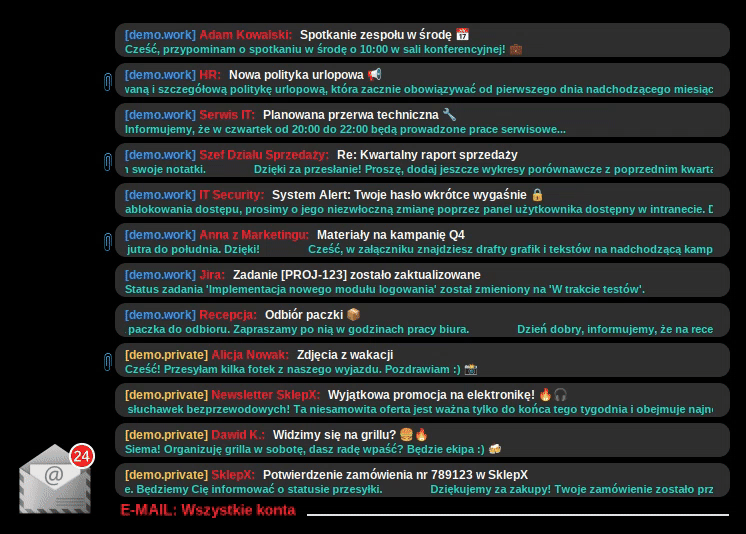
    
    - **Filtrowanie kont:** Dynamicznie przełączanie widoku między wszystkimi kontami, za pomocą skryptu **`Zmień_wyświetlane_konto.sh`**
      
    -   **Zaawansowane renderowanie tekstu:** Duże wsparcie dla **emoji** w tematach i podglądzie wiadomości, a także animowane, płynne przewijanie dla zbyt długich treści.
---

#### Przyjazny dla użytkownika zbiór narzędzi:

*   **Sprytny zestaw skryptów instalacji oraz konfiguracji w GUI z wykorzyztaniem Zenity:** Zapomnij o ręcznej edycji plików oraz potrzebnych zależnościach! Projekt zawiera zestaw skryptów z interfejsem graficznym (**`Zenity`**), które prowadzą użytkownika krok po kroku przez cały proces:
      - Automatycznego wykrywania dystrybucji i instalacji odpowiednich zależności. **`1.Instalacja_zależności.sh`**
   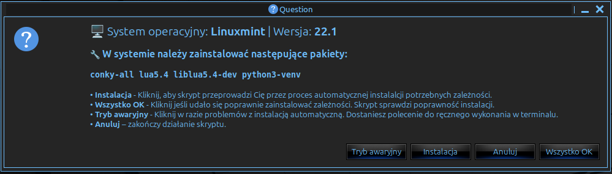
      - ~~Automatycznej konfiguracji wszystkich niezbędnych ścieżek w plikach projektu. **`2.Podmiana_ścieżek_bezwzględnych_w_zmiennych.sh`** (Przenieś folder gdzie chcesz i nazwij jak chcesz 😉)~~
      - Pliki konfiguracyjne **`conkyrc_zupix`** oraz **`e-mail.lua`** od wersji **`v1.2.0`** są całkowicie portable i automatycznie wykrywają lokalizację projektu. Skrypt **`2.Podmiana_ścieżek_bezwzględnych_w_zmiennych.sh`** nie jest już potrzebny.
   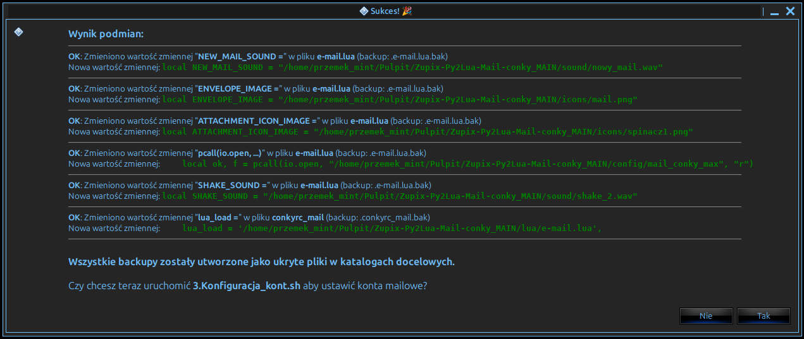
      - Graficzny menedżer dodawania, edytowania, przesuwania oraz usuwania kont e-mail. **`2.Konfiguracja_kont.sh`**
   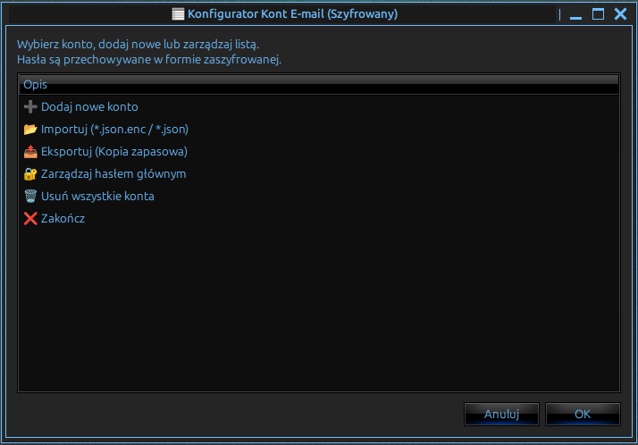
   
      - **Solidne zarządzanie procesami:** Główny skrypt startowy **`3.START_RESTART_skryptów_oraz_conky.sh`** dba o to, by widget działał nieprzerwanie i stabilnie. Zawiera mechanizm "watchdoga", który automatycznie restartuje Conky w razie awarii lub nadmiernego zużycia pamięci. Uruchomiony ręcznie w oknie terminala dostarcza dużo informacji na temat tego co dzieje się pod maską.
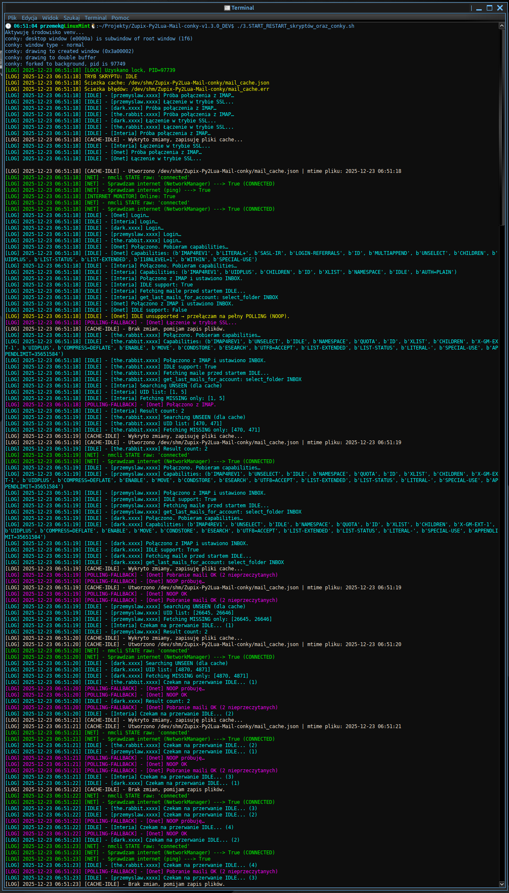
*   **Narzędzia pomocnicze:** Zestaw skryptów do łatwego testowania i zarządzania widgetem (np. oznaczanie maili jako przeczytane/nieprzeczytane, zmiana layoutu w locie).

     
    - Wsadowe oznaczanie wiadomości na kontach jako nieprzeczytane. **`Oznacz_n_wiadomości_jako_nieprzeczytane.sh`**       
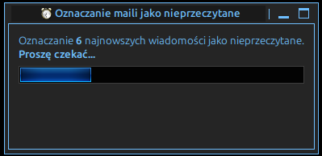
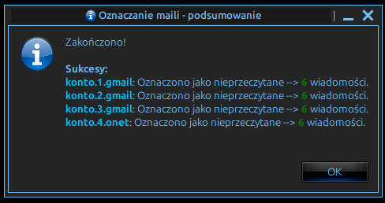

    - Wsadowe oznaczanie wiadomości na kontach jako przeczytane. **`Oznacz_wszystkie_wiadomości_jako_przeczytane.sh`**     
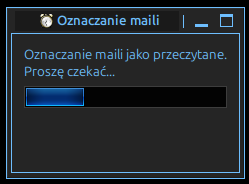      
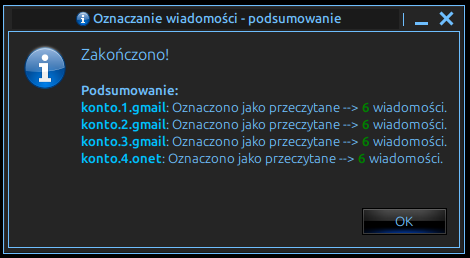

    - Skrypt do płynnej zmiany layoutów oraz skalowania podczas działania widgetu. **`Zmiana_layoutu_oraz_skalowania.sh`**
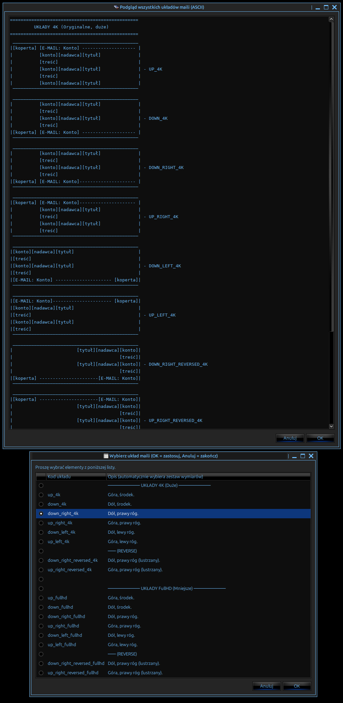   

---

## Rozbudowana personalizacja (e-mail.lua)

Dla użytkowników, którzy chcą dostroić każdy, nawet najmniejszy detal wyglądu, plik `e-mail.lua` oferuje ogromne możliwości konfiguracji. Poniżej znajduje się opis kluczowych zmiennych, które można modyfikować.

### Ustawienia globalne i animacje

| Zmienna                 | Opis                                                                                              |
| ----------------------- | ------------------------------------------------------------------------------------------------- |
| `SCALE`                 | Globalny mnożnik skalowania całego widgetu. `1.0` = 100%, `0.85` = 85%.                             |
| `ENABLE_NEW_MAIL_PULSE` | `true` / `false` – Włącza lub wyłącza animację pulsowania tła dla nowo otrzymanych maili.             |
| `PULSE_COLOR`           | Kolor pulsowania w formacie `{R, G, B}` (wartości od 0.0 do 1.0). Domyślnie czerwony `{1, 0, 0}`.     |
| `PULSE_DURATION`        | Czas trwania animacji pulsowania w sekundach (np. `4.0`).                                           |
| `PULSE_SPEED`           | Szybkość migania (wyższa wartość = szybsze miganie).                                                |

### Tło główne

| Zmienna                      | Opis                                                                                                 |
| ---------------------------- | ---------------------------------------------------------------------------------------------------- |
| `ENABLE_MAIN_BACKGROUND`     | `true` / `false` – Włącza lub wyłącza półprzezroczyste tło za całym widgetem.                          |
| `MAIN_BACKGROUND_COLOR`      | Kolor tła w formacie `{R, G, B}` (wartości od 0.0 do 1.0).                                           |
| `MAIN_BACKGROUND_ALPHA`      | Kontroluje przezroczystość tła (`0.0` = całkowicie przezroczyste, `1.0` = pełne krycie).               |
| `MAIN_BACKGROUND_RADIUS`     | Promień zaokrąglenia rogów tła.                                                                      |
| `MAIN_BACKGROUND_PADDING`    | Wewnętrzny margines (w pikselach) od krawędzi okna Conky.                                              |
| `MAIN_BACKGROUND_OFFSET_X/Y` | Ręczna korekta położenia tła w osi X i Y (w pikselach).                                                |

### Wygląd listy maili (Czcionki, Kolory, Wymiary)
Większość tych zmiennych ma swoje odpowiedniki z końcówką `_BASE` dla rozdzielczości 4K i FullHD.

| Zmienna                      | Opis                                                                                                                                      |
| ---------------------------- | ----------------------------------------------------------------------------------------------------------------------------------------- |
| `MAILS_WIDTH_BASE`           | Podstawowa szerokość bloku z listą maili.                                                                                                   |
| `ENVELOPE_SIZE_BASE`         | Rozmiar ikony koperty.                                                                                                                    |
| `BADGE_RADIUS_BASE`          | Promień "badge'a" (licznika nieprzeczytanych maili).                                                                                        |
| `FROM_FONT_SIZE_BASE`        | Rozmiar czcionki dla nadawcy.                                                                                                             |
| `SUBJECT_FONT_SIZE_BASE`     | Rozmiar czcionki dla tematu.                                                                                                              |
| `PREVIEW_FONT_SIZE_BASE`     | Rozmiar czcionki dla podglądu treści.                                                                                                     |
| `HEADER_SIZE_BASE`           | Rozmiar czcionki dla nagłówka ("E-MAIL: ...").                                                                                              |
| `FROM_FONT_NAME`, `SUBJECT_FONT_NAME`, etc. | Nazwa czcionki (np. `"Arial"`, `"Ubuntu"`).                                                                                    |
| `FROM_FONT_BOLD`, `SUBJECT_FONT_BOLD`, etc. | `true` / `false` – Włącza pogrubienie dla danego elementu.                                                                      |
| `FROM_COLOR_TYPE`, `SUBJECT_COLOR_TYPE`, etc. | Typ koloru. Może być `"white"`, `"red"`, `"black"`, `"orange"` lub `"custom"`, aby użyć wartości z `..._COLOR_CUSTOM`. |
| `FROM_COLOR_CUSTOM`, `SUBJECT_COLOR_CUSTOM`, etc. | Własny kolor w formacie `{R, G, B}` (wartości 0-1 lub 0-255).                                                             |
| `MAIL_BG_COLOR`              | Kolor tła "mleka" dla pojedynczego wiersza maila.                                                                                           |
| `MAIL_BG_ALPHA`              | Przezroczystość tła "mleka".                                                                                                              |

### Zachowanie i funkcjonalność

| Zmienna                   | Opis                                                                                                                                                                  |
| ------------------------- | --------------------------------------------------------------------------------------------------------------------------------------------------------------------- |
| `MAILS_DIRECTION`         | Kluczowa zmienna określająca układ. Zmieniana automatycznie przez skrypt `Zmiana_pozycji...`.                                                                           |
| `RIGHT_LAYOUT_REVERSED`   | `true` / `false` – Włącza lustrzany (od prawej do lewej) układ dla layoutów w prawym rogu.                                                                               |
| `BADGE_VALUE_SOURCE`      | Określa, co ma pokazywać licznik: `"unread_cache"` (maile w widgecie), `"all"` (wszystkie maile w skrzynce) lub `"unread"` (wszystkie nieprzeczytane na serwerze).       |
| `SHOW_SENDER_EMAIL`       | `true` / `false` – Jeśli `true`, pokaże pełny adres e-mail nadawcy zamiast jego nazwy.                                                                                 |
| `SHOW_MAIL_PREVIEW`       | `true` / `false` – Włącza lub wyłącza drugą linię z podglądem treści maila.                                                                                               |
| `ENABLE_PREVIEW_SCROLL`   | `true` / `false` – Włącza animację przewijania dla zbyt długich podglądów.                                                                                                |
| `ATTACHMENT_ICON_ENABLE`  | `true` / `false` – Włącza wyświetlanie ikony spinacza przy mailach z załącznikami.                                                                                      |

---

---

## Architektura projektu

Projekt oparty jest na trzech głównych, współpracujących ze sobą komponentach:

### 1. Backend (Python)

To serce operacji, działające w tle jako cichy i wydajny demon. Jego główne zadania to:

*   **Nawiązywanie połączeń IMAP:** Utrzymuje stałe połączenie z serwerami pocztowymi w trybie IDLE lub cyklicznym Polling.
*   **Pobieranie i przetwarzanie danych:** Odczytuje nowe wiadomości, czyści ich treść z niepotrzebnych elementów i przygotowuje do wyświetlenia.
*   **Generowanie cache:** Przetworzone dane o mailach są zapisywane w pliku tymczasowym (`JSON`), który służy jako źródło danych dla frontendu.

### 2. Frontend (Lua / Conky)

To warstwa wizualna, którą widzisz na pulpicie. Skrypt Lua renderowany przez Conky jest odpowiedzialny za:

*   **Odczyt danych:** W każdej pętli pobiera najnowsze informacje o mailach z pliku cache.
*   **Renderowanie grafiki:** Używając biblioteki Cairo, rysuje cały interfejs widgetu, w tym tekst, ikony, tła i animacje.
*   **Obsługa interakcji:** Odczytuje pliki sterujące, aby reagować na akcje użytkownika, takie jak przewijanie listy czy zmiana aktywnego konta.

### 3. Skrypty Pomocnicze (Bash / Zenity)

To przyjazny dla użytkownika "klej", który spaja cały system. Zestaw skryptów z interfejsem graficznym (`Zenity`) automatyzuje podstawowe aspekty zarządzania projektem:

*   **Instalacja i konfiguracja:** `1.Instalacja_zależności.sh` --> `2.Podmiana_ścieżek_bezwzględnych_w_zmiennych.sh` --> `3.Konfiguracja_kont.sh` -  Prowadzą użytkownika krok po kroku przez cały proces, od instalacji zależności po dodanie kont e-mail.
*   **Zarządzanie i sterowanie:** `4.START_skryptów_oraz_conky.sh`, `Zmiana_pozycji_okna_conky_oraz_layoutu.sh`, `Zmień_konto.sh` -  Pozwalają zarządzać cyklem życia całej aplikacji, w locie zmieniać układ widgetu, a także przełączać widok kont.

---

## Struktura Projektu
```
.
├── 1.Instalacja_zależności.sh                        # Krok 1: Instalator zależności
├── 2.Konfiguracja_kont.sh                            # Krok 2: Menedżer kont e-mail
├── 3.START_RESTART_skryptów_oraz_conky.sh            # Krok 3: Główny skrypt uruchomieniowy z mechanizmem restartu
├── add_hotkey_mail_down.sh                           # Skrypt bash do zmniejszania indeksu w pliku `conky_mail_scroll_offset` (przewijanie listy w górę)
├── add_hotkey_mail_up.sh                             # Skrypt bash do zwiększania indeksu w pliku `conky_mail_scroll_offset` (przewijanie listy w dół)
├── Authors.txt                                       # Podstawowe informacje o autorach oraz kontakt
├── config                                            # Folder z plikami konfiguracyjnymi
|   ├── avatar_map.json                               # Plik json z mapą adresów e-mail oraz lokalizacji plików png, dla funkcji avatarów
│   ├── accounts.json                                 # Główny plik z danymi kont (dla backendu ZupixPyMail.py)
│   ├── denoise_patterns                              # Plik tekstowy z ręcznymi definicjami czyszczenia maili
│   └── mail_conky_max                                # Plik tekstowy z limitem maili na liście wigetu, wyrażonym w cyfrach całkowitych naturalnych 
├── conkyrc_zupix                                     # Główny plik konfiguracyjny Conky
├── icons                                             # Ikony
│   ├── mail1.png                                     # --
│   ├── mail2.png                                     # --
│   ├── mail3.png                                     # --
│   ├── mail4.png                                     # --
│   ├── mail5.png                                     # --
│   ├── mail6.png                                     # --
│   ├── mail.png                                      # --
│   ├── spinacz1.png                                  # --
│   └── spinacz3.png                                  # --
├── License.txt                                       # Licencja GPL v3+
├── log                                               # Folder przewidziany na logi (przyszła funkcjonalność) 
├── lua                                               # Skrypty frontendu (Lua)
│   ├── dkjson.lua                                    # Skrypt lua do obsługi JSON
│   └── e-mail.lua                                    # Główna logika wizualna widgetu
├── Oznacz_n_wiadomości_jako_nieprzeczytane.sh        # Skrypt bash do oznaczania N najnowszych wiadomości jako nieprzeczytane
├── Oznacz_wszystkie_wiadomości_jako_przeczytane.sh   # Skrypt bash do oznaczania wszystkich wiadomości jako przeczytane
├── py                                                # Skrypty backendu (Python)
│   ├── venv                                          # Wirtualne środowisko Python dla backendu (tworzone podczas działania `1.Instalacja_zależności.sh`)
│   └── ZupixPyMail.py                                # Serce projektu. Główny skrypt python pobierający maile
├── sound                                             # Folder z plikami dźwiękowymi 
│   ├── error_2.wav                                   # --
│   ├── error.wav                                     # --           
│   ├── notification_1.wav                            # --
│   ├── notification_2.wav                            # --
│   ├── notification_3.wav                            # --
│   ├── notification_4.wav                            # --
│   ├── notification_5.wav                            # --
│   ├── notification_6.wav                            # --
│   ├── nowy_mail.wav                                 # --
│   ├── pop-up_1.wav                                  # --
│   ├── remove_mail1.wav                              # --
│   ├── shake_2.wav                                   # --
│   ├── start_1.wav                                   # --
│   ├── start_2.wav                                   # --
│   ├── start_3.wav                                   # --
│   └── start_notification_1.wav                      # --
├── Zmiana_layoutu_oraz_skalowania.sh                 # Skrypt bash do zmiany layoutu oraz skalowania
└── Zmień_wyświetlane_konto.sh                        # Skrypt bash do zmiany wyświetlanego konta
```
---

## Instalacja i Konfiguracja

Instalacja jest niezwykle prosta dzięki graficznemu kreatorowi. **Ręczna edycja plików konfiguracyjnych nie jest potrzebna.**


1.  **Sklonuj repozytorium**:
    Otwórz terminal i wklej poniższe komendy. Pierwsza pobierze projekt, a druga wejdzie do głównego katalogu z plikami:
    ```bash
    git clone https://github.com/ZupixUI/Zupix-Py2Lua-Mail-conky.git
    cd Zupix-Py2Lua-Mail-conky
    ```
    Możesz też pobrać gotową paczkę  - https://github.com/ZupixUI/Zupix-Py2Lua-Mail-conky/releases

2.  **Nadaj uprawnienia do wykonania skryptom**:
    Skrypty sh powinny być oznaczone jako wykonywalne, ale gdyby z jakiś powodów nie były, nadaj im wsadowo prawa do wykonywania:
    ```bash
    chmod +x *.sh
    ```

3.  **Uruchom instalator `1.Instalacja_zależności.sh`**:
    To jedyny krok, który musisz wykonać. Uruchom pierwszy skrypt `1.Instalacja_zależności.sh`, a reszta zrobi się sama! Grupa spiętych skryptów przeprowadzi Cię przez cały proces: instalację zależności, tworzenie venv oraz dodawanie kont e-mail za pomocą graficznego menedżera. Po zakończeniu konfiguracji kont, skrypt zaproponuje automatyczne uruchomienie widgetu.
    Skrypty zostały zaprojektowane do uruchamiania bezpośrednio z poziomu menedżera plików (GUI), ale jeśli napotkasz jakiś problem z uruchomieniem użyj w konsoli:
    ```bash
    ./1.Instalacja_zależności.sh
    ```
    Postepuj tak samo z resztą skryptów, jeśli z jakiś powodów skrypt pierwszy po zakończonej pracy nie uruchomi kolejnego skryptu.

## Zależności

Instalator automatycznie zajmie się instalacją wszystkich wymaganych pakietów. Główne zależności to:

  *  `conky-all` dla Debian/Ubuntu lub `conky` (z obsługą Lua/Cairo)

  *  `python3` + python3-venv (dla dystrybucji Debian i pochodnych)

  *  `lua` (zalecana wersja 5.3/5.4)

  *  `zenity` (dla interfejsu graficznego skrypotów *.sh)

  *  `jq` (do edycji plików JSON)

  *  `libnotify` (dla powiadomień systemowych notify-send)

  *  `Noto Color Emoji` Czcionka z emotkami.


## Autorzy i Licencja

### Autorzy projektu
* **Amator_80**: <mmajcher804@gmail.com> (Discord: Amator80)
* **Zupix**: <zupix.py.lua.mail.conky@gmail.com> (Discord: Zupix)
> **Warto wiedzieć:** Oba projekty, choć zrodzone z podobnej idei, powstały i były rozwijane niezależnie. Prezentują odmienne filozofie i rozwiązania techniczne. Zachęcamy do zapoznania się z oboma, aby wybrać widżet, który najlepiej pasuje do Twoich oczekiwań i stylu pracy.

Możesz spotkać nas na serwerze Discord: **Świat Linuksa** - [https://discord.com/invite/69EMVfN](https://discord.com/invite/69EMVfN)

### Powiązane Projekty
Warto również zapoznać się z siostrzanym projektem autorstwa **Amator_80**, który stanowi alternatywne podejście do tego samego zagadnienia:
* **conky-automail-suite** – Drugi w pełni funkcjonalny widżet do monitorowania poczty, rozwijany równolegle.
* **Repozytorium na GitHub**: [https://github.com/Amator80/conky-automail-suite](https://github.com/Amator80/conky-automail-suite)


